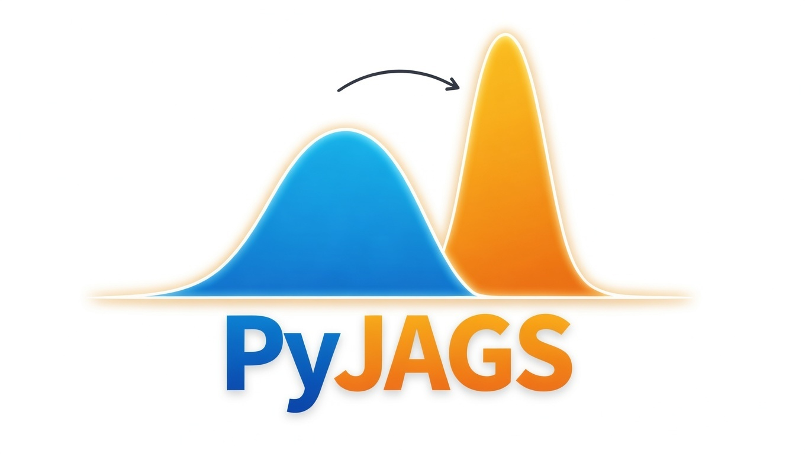

# PyJAGS

<p align="center">
  
</p>

<p align="center"><em>From prior to posterior</em></p>

**PyJAGS** brings [JAGS](https://mcmc-jags.sourceforge.io/) (Just Another
Gibbs Sampler) to Python -- a mature, battle-tested engine for Bayesian
inference via Markov Chain Monte Carlo, trusted by researchers in
statistics, ecology, epidemiology, and finance for over two decades.

## Why PyJAGS?

- **Instant models** -- JAGS interprets the BUGS language at runtime. No compilation, no waiting.
- **Discrete parameters** -- mixture models, change-points, hidden Markov models. JAGS samples them directly.
- **Incremental sampling** -- extend a run with one line of code. Save to HDF5, resume tomorrow.
- **The BUGS ecosystem** -- decades of published models from textbooks and papers, immediately available.
- **Information-theoretic diagnostics** -- with [Divergence](https://github.com/michaelnowotny/divergence), measure how much the data taught you, detect outliers, and compare models distribionally.

## Quick Start

```python
import pyjags
import arviz as az

model = pyjags.Model(code=model_code, data=data, chains=4, seed=42)
model.sample(1000, vars=[])                       # burn-in
samples = model.sample(5000, vars=["mu", "sigma"]) # production

idata = pyjags.from_pyjags(samples)
az.summary(idata)
```

## Tutorials

Each tutorial tells a story -- from the Reverend Bayes' posthumous theorem
to the 2008 financial crisis:

1. **[The Reverend's Question](notebooks/Getting Started.ipynb)** -- your first Bayesian model
2. **[The Paradox of Shrinkage](notebooks/Eight Schools.ipynb)** -- hierarchical models and partial pooling
3. **[The Wells of Bangladesh](notebooks/Logistic Regression.ipynb)** -- logistic regression with real human stakes
4. **[The Hidden Cost of Every Trade](notebooks/Trading Cost Estimation.ipynb)** -- latent variables in finance
5. **[When It Rains, It Pours](notebooks/Advanced Functionality.ipynb)** -- stochastic volatility and the practitioner's toolkit

## Installation

```bash
# Docker (fastest)
./scripts/jagslab build && ./scripts/jagslab start

# Native (macOS)
brew install jags && pip install pyjags

# Native (Linux)
sudo apt install jags && pip install pyjags
```

See the [Installation Guide](getting-started/installation.md) for detailed instructions.
